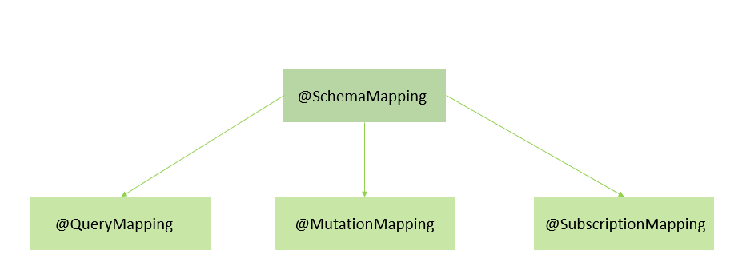

# Spring-GraphQL 
 
Spring Boot Application with the implementation of GraphQL. 
<b>Systematic Diagram for GraphQL:</b> 
 

 
===================================================================================

 

 
1.@SchemaMapping: This annotation maps and binds a handler with the field in the GraphQL schema, it can be used at the method or class level. 
It accepts two parameters typeName= and field=. It’s also the parent annotations of the other query-specific annotations. 
2.@QueryMapping: @QueryMapping is a composed annotation that acts as a shortcut for @SchemaMapping with typeName="Query". 
3.@MutationMapping: This annotation maps handler methods with the mutation query in the GraphQL schema. 
4.@SubscriptionMapping: Similar to a query allowing you to fetch data from the server. Subscriptions offer a long-lasting 
operation that can change their result over time.
